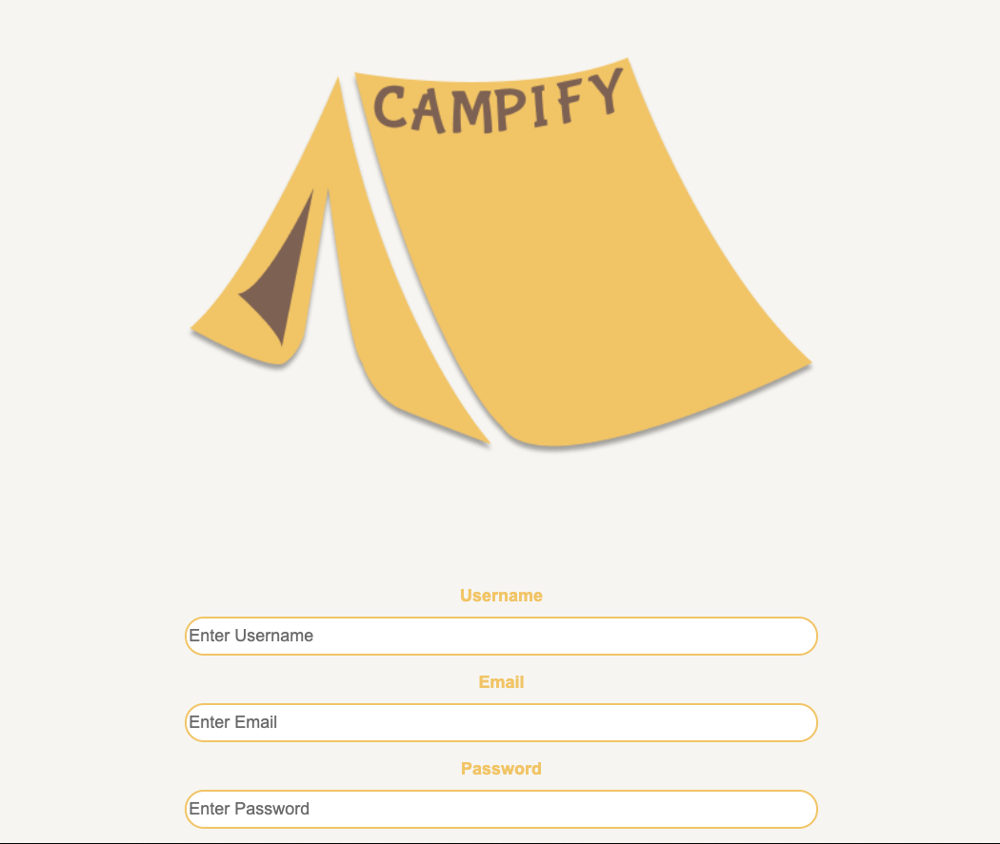

  
  
  # Campify
  ## Description
  #### Group Project #2 - We created Campify to create a social platform for anyone who loves the great outdoors.  This is a members-only site where you can search for rec areas, campsites and activities near your current location AND pin your favorites to your profile page.  On the user's profile page, there is a calendar where he or she can post events and share with friends.  Let's plan a weekend together where we sleep outside and stare at the stars!
  # Table of Contents
   * [Installation](#installation)
   * [Usage](#usage)
   * [License](#license)
   * [Contributors](#contributors)
   * [Tests](#tests)
   * [Questions](#questions)
  ## Installation
  #### express, sequelize, handlebars, session, passport, node
  ## Usage
  #### 
  #### See video here:
  #### See fully deployed Heroku app here:
  #### https://campifygroupproject.herokuapp.com/
  ## License
  #### This project is licensed under the MIT license.
  ## Contributing
  #### Travis Cook, Andy Ives, Katie Anilionis, Jonathan Letourneau, Anthony Militello, Erin McGeever
  ## Test
  #### 
  ## Questions
  #### Email: 
  #### <a>travismcook93@gmail.com</a>
  #### <a>andreasue3@gmail.com</a>
  #### <a>kanilionis@gmail.com</a>
  #### <a>jonathanletourneau17@gmail.com</a>
  #### <a>anthony.militello.am@gmail.com</a>
  #### <a>mcheevee@colorado.edu</a>
  #### GitHub: 
  #### <a>github.com/travcook</a>
  #### <a>github.com/andreaives</a>
  #### <a>github.com/kanilionis</a>
  #### <a>github.com/ophza</a>
  #### <a>github.com/amilitello</a>
  #### <a>github.com/mcgeevee</a>
  
